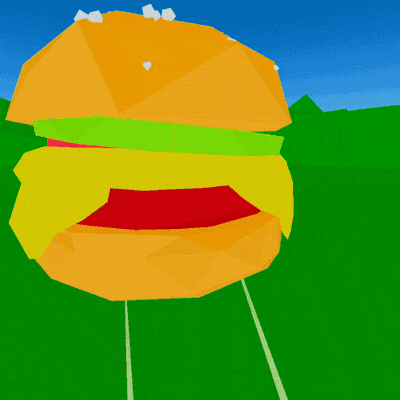
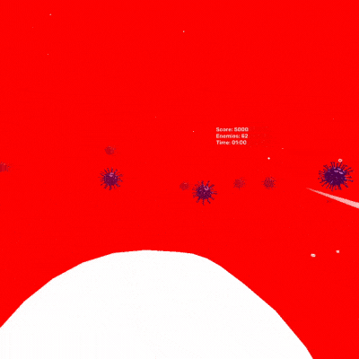
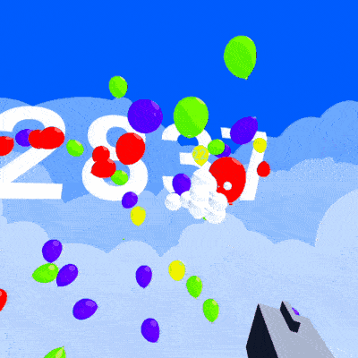

# VR Games
I'm going to make 6 VR games (prototypes) this year. 0.5 VR game a month.

## 3. Five seconds [VR Hamburger Consuming Simulator]

The goal is to consume hamburgers when they land on the ground before their 5 seconds timer is passed. 

The VR Game is heavily inspired by "Dorohedoro" and "How I met your mother" TV shows.

[DevLog](https://twitter.com/Volorf/status/1275877461222395906)

[Download APK for Oculus Quest](FiveSeconds/5sec.apk)

**Tools**:
* **Music**: Beepbox
* **3D Editor**: Blender
* **Game Engine**: Unity 3D
* **Platform**: Oculus Quest

## 2. Paper Against Viruses [VR Shooter]

You are a secret agent of a secret health organization. The organization made you small like a bunch of atoms and sent you to fight against a hazardous unknown disease. It turned out that it was aliens from a different parallel world.

[DevLog](https://twitter.com/Volorf/status/1240911612007112705)

[Download APK for Oculus Quest](PaperAgainstViruses/PaperAgainstViruses.apk)

**Tools**:
* **Music**: Ableton Live
* **Game Engine**: Unity 3D
* **Platform**: Oculus Quest

## 1. Apopalypse [VR Shooter]

It's an incredible story about a war against balloons. Ballons suck people's souls to be inflated, and your mission is to stop them from doing this.

[DevLog](https://twitter.com/Volorf/status/1203958100945969153)

[Download APK for Oculus Quest](Apopalypse/Apopalypse.apk)

**Tools**:
* **Music**: Garage Band
* **Sound FX**: Apple's Voice Memos
* **Game Engine**: Unity 3D
* **Platform**: Oculus Quest

